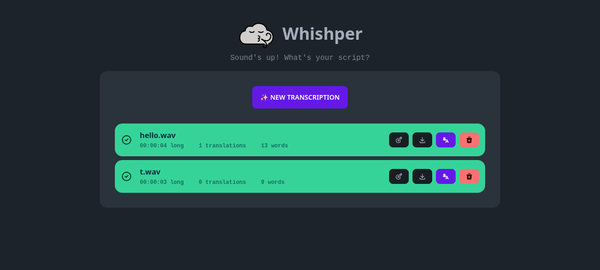

### [Whishper](https://github.com/pluja/whishper)

> Handle: `whishper`<br/>
> URL: [http://localhost:35060](http://localhost:35060)



Whishper is a self-hosted, fully local audio transcription and subtitling suite built on [faster-whisper](https://github.com/SYSTRAN/faster-whisper). Upload audio/video files or paste a media URL, get timestamped transcripts, edit them in a subtitle editor, download them as SRT/VTT/TXT/JSON, and translate them with LibreTranslate.

**Key Features:**
- **Local transcription**: faster-whisper models from `tiny` to `large-v3`, CPU or NVIDIA GPU
- **Subtitle editor**: per-segment timing and text editing in the browser
- **Exports**: SRT, VTT, TXT and JSON downloads
- **Translation**: subtitles translated through Harbor's LibreTranslate
- **URL sources**: transcribe YouTube and other media URLs directly
- **REST API**: transcription upload, listing, editing and translation are available under `/api` (the SRT/VTT/TXT/JSON exports are rendered in the browser)

#### Starting

```bash
# [Optional] pre-pull the images
harbor pull whishper

# Run the service
harbor up whishper --open
```

- Whishper ships with a MongoDB aux container (`whishper-mongo`) and runs on CPU by default
- On the first start, every model size in `HARBOR_WHISHPER_MODELS` is downloaded from Hugging Face into the workspace. The container only reports healthy once that finished; transcriptions submitted before that fail with status `-1`. `harbor up` waits for the healthy state; the download progress is only written to the worker log: `tail -f services/whishper/data/logs/transcription.err.log`
- To enable translation, run it together with Harbor's [LibreTranslate](./2.3.41-Satellite-libretranslate.md):
  ```bash
  harbor up whishper libretranslate
  ```
- With NVIDIA GPUs (`harbor up whishper nvidia`), the `<HARBOR_WHISHPER_VERSION>-gpu` image tag is used and the GPU is passed through
- The UI is served same-origin, so it works from `http://localhost:35060`, from your LAN IP (`http://<host-ip>:35060`) and through the [Traefik](./2.3.37-Satellite-traefik.md) route `https://whishper.<HARBOR_TRAEFIK_DOMAIN>` without any extra configuration. Only set `HARBOR_WHISHPER_PUBLIC_URL` if the API must be reached on a different origin than the page (see below)

#### Usage

- **New transcription**: pick a file (or a YouTube/media URL), choose a model size and language, click **Start**. Larger models are slower on CPU but far more accurate
- **Edit**: opens the subtitle editor with per-segment timing and text
- **Translate**: requires `libretranslate` to be running; pick a target language and the translation is added to the transcription. Translating into a language the transcription already has is rejected by the backend and leaves the row in the `translating` state (status 3); reload the page and pick another language, or delete and re-transcribe to clear it
- **Download**: export as SRT, VTT, TXT or JSON

The same workflow is available from the shell via the REST API:

```bash
# Submit a file (language, modelSize and device match the UI form)
curl -F file=@hello.wav -F language=en -F modelSize=tiny -F device=cpu \
  http://localhost:35060/api/transcriptions

# Poll until "status": 2, then read result.text
curl http://localhost:35060/api/transcriptions/<id>

# Translate (with libretranslate running), stored under "translations"
curl http://localhost:35060/api/translate/<id>/es
```

#### Configuration

##### Environment Variables

Following options can be set via [`harbor config`](./3.-Harbor-CLI-Reference.md#harbor-config):

```bash
# Host port for the web UI
HARBOR_WHISHPER_HOST_PORT          35060

# Origin the browser uses for /api calls (sets PUBLIC_API_HOST). Empty means
# same-origin, i.e. whatever URL the page was opened on - keep it empty unless
# the API is exposed on a separate origin, e.g. http://whishper.example.com
HARBOR_WHISHPER_PUBLIC_URL         ""

# Image and tag (the nvidia cross-file switches the tag to <version>-gpu)
HARBOR_WHISHPER_IMAGE              pluja/whishper
HARBOR_WHISHPER_VERSION            latest

# MongoDB aux container
HARBOR_WHISHPER_MONGO_IMAGE        mongo
HARBOR_WHISHPER_MONGO_VERSION      7

# Persistent data root (uploads, models, logs, db)
# Either relative to $(harbor home) or an absolute path
HARBOR_WHISHPER_WORKSPACE          ./services/whishper/data

# Comma-separated whisper model sizes preloaded on startup (the UI's model
# picker is a fixed list; sizes outside it can be requested via the API)
# (tiny, base, small, medium, large-v2, large-v3, plus .en variants)
HARBOR_WHISHPER_MODELS             tiny,base,small

# CPU threads used by faster-whisper
HARBOR_WHISHPER_CPU_THREADS        4

# MongoDB credentials (shared by both containers)
HARBOR_WHISHPER_DB_USER            whishper
HARBOR_WHISHPER_DB_PASSWORD        whishper
```

##### Volumes

All persistent data lives under `HARBOR_WHISHPER_WORKSPACE`:
- `services/whishper/data/uploads/` - uploaded media files (`/app/uploads`)
- `services/whishper/data/models/` - downloaded faster-whisper models (`/app/models`)
- `services/whishper/data/logs/` - supervisor logs for backend, frontend, transcription worker and nginx (`/var/log/whishper`)
- `services/whishper/data/db/` - MongoDB data of `whishper-mongo` (owned by the mongo user)

The image hardcodes `/app/uploads` and `/app/models`, so Harbor starts the container through `services/whishper/entrypoint.sh`, which symlinks both into the single `/workspace` mount. The `whishper-init` sidecar chowns the workspace to your host user (`HARBOR_USER_ID`/`HARBOR_GROUP_ID`) before each start, so files stay manageable without `sudo`. The whishper processes run as root, so files written during a session become host-owned on the next `harbor up`.

##### Cross-service integrations

- `compose.x.whishper.libretranslate.yml` - sets `TRANSLATION_ENDPOINT=libretranslate:5000` and the entrypoint rewrites nginx's `/languages` upstream to it (the image hardcodes `translate:5000` and nginx would refuse to start without it, so standalone `whishper` serves `/languages` as 502 instead)
- `compose.x.whishper.nvidia.yml` - switches to the `${HARBOR_WHISHPER_VERSION}-gpu` image and reserves NVIDIA GPUs
- `compose.x.traefik.whishper.yml` - exposes the UI as `whishper.<HARBOR_TRAEFIK_DOMAIN>` when running with [Traefik](./2.3.37-Satellite-traefik.md)

#### Troubleshooting

##### Check Logs

```bash
harbor logs whishper
harbor logs whishper-mongo

# Supervisor logs of the in-container processes (nginx, backend, frontend, worker)
ls services/whishper/data/logs/

# Transcription worker log
harbor exec whishper tail -n 50 /var/log/whishper/transcription.err.log
```

##### Transcription stays pending or fails with status -1

The worker only accepts jobs once every model in `HARBOR_WHISHPER_MODELS` is downloaded. Wait for `harbor ps` to show `whishper` as healthy, then resubmit. First use of a model size not in the list downloads it on demand; on CPU, `medium`/`large` models are slow.

##### Translate button does nothing / language list empty

`libretranslate` is not running. Start with `harbor up whishper libretranslate`. LibreTranslate itself downloads its language models on first boot, `harbor logs libretranslate` to see the progress.

##### UI loads but the transcription list is empty on a LAN or traefik client

The frontend calls `${HARBOR_WHISHPER_PUBLIC_URL}/api/...` from the browser. Keep the variable empty (same-origin, the default) unless the API really lives on another origin; a value like `http://localhost:35060` only works when the browser runs on the Docker host.

##### Poor accuracy

Switch to a larger model (`small.en`, `medium`) or use the GPU image via `harbor up whishper nvidia`.

##### Reset the database

```bash
harbor down whishper
# WARNING: destroys all transcriptions (db/ is owned by the mongo user, hence sudo)
sudo rm -rf services/whishper/data/db
harbor up whishper
```

#### Links

- [Official Documentation](https://whishper.net/)
- [GitHub Repository](https://github.com/pluja/whishper)
- [faster-whisper](https://github.com/SYSTRAN/faster-whisper)
